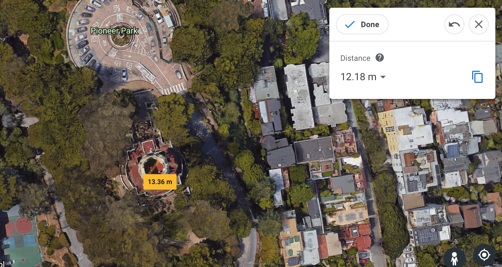

# Question Time!

1.) Introduce yourself, explain your connection to IGN, and tell us why we should pick you to participate in IGN’s Code Foo program. Show your enthusiasm and passion for IGN in the form of a YouTube/Vimeo video, written document, audio track, or whatever format you feel most comfortable with. 

**I answered this question with [youtube video!](https://www.youtube.com/watch?v=wVXAjkKyRMc)**

2.) Team Rocket is at it again! This time they are looking to terrorize the city of San Francisco, and aim to make the trek through the “crookedest street in the world” ( Lombard Street ) to steal a treasure contained in Coit Tower. Legend has it, the tower is completely filled with Poké Balls, enough Poké Balls for Team Rocket to amass an army of Pokémon! Fortunately, a slumbering Pokémon is known to sleep at the bottom of Lombard St and block the entrance to Coit Tower entirely. If Team Rocket determines how to wake the sleeping giant and successfully steals the cache of Poké Balls that fills Coit Tower, about how many Poké Balls would they walk away with? Describe each step in your thought process.

**First I need to find the volume of coit tower in cubic feet and divide it by the volume of a single pokeball. This will give me the amount of pokeballs in Coit Tower and therefore many Team Rocket will walk away with. According to the Wiki, Coit Tower is 210 ft tall. Using Google Earth, I was able to estimate the diameter of the tower to be 12.18 meters or 40 ft.**

3.) After a hard fought battle with a particularly tough Werewolf, renowned Witcher Geralt of Rivia is in need of some new armor. Fortunately, there was a bounty for the recently defeated beast, and for his triumph Geralt has received a good bit of coin ( called Crowns ). Traveling to a nearby armorer, Geralt is faced with more options than he is used to. Given his funds, the Witcher needs to purchase an armor set with the highest possible total armor value.

Create a program that will determine the armor set of the highest value based on Geralt’s available currency ( Crowns ). An armor set requires one piece of armor of each type (Chest, Leggings, Helmet, Boots) as well as an extra piece that can be of any type.

- 300 Crowns Available
- You must be able to afford the total price of your armor set given your available Crowns
- Each piece of armor contains a type, name, price, and armor value
- Remember, an armor set requires one piece of armor of each type (Chest, Leggings, Helmet, Boots) as well as an extra piece that can be of any type
- Inventory in Armorer’s shop provided
- Display the final answer.
- Explain how you implemented the solution. Is your solution successful with other inventories?

**I answered this problem with a React app that can be found here: ** 
